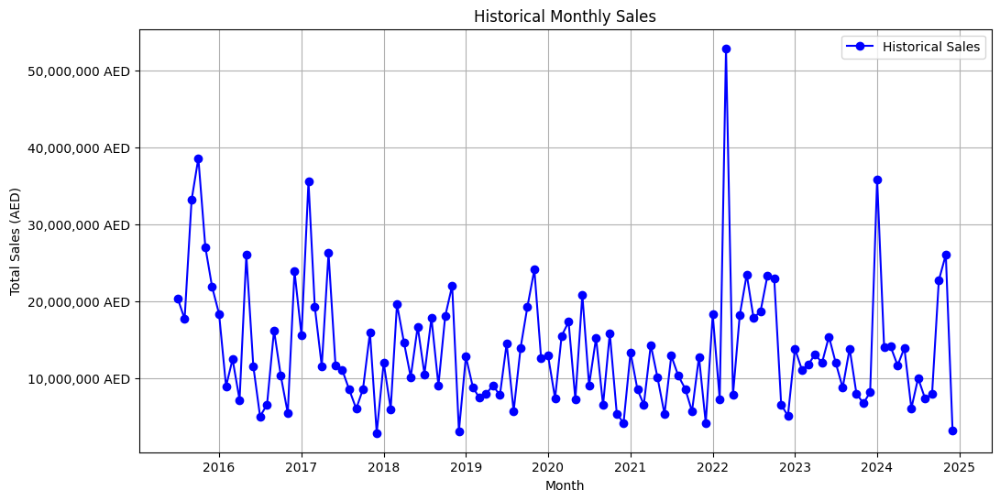
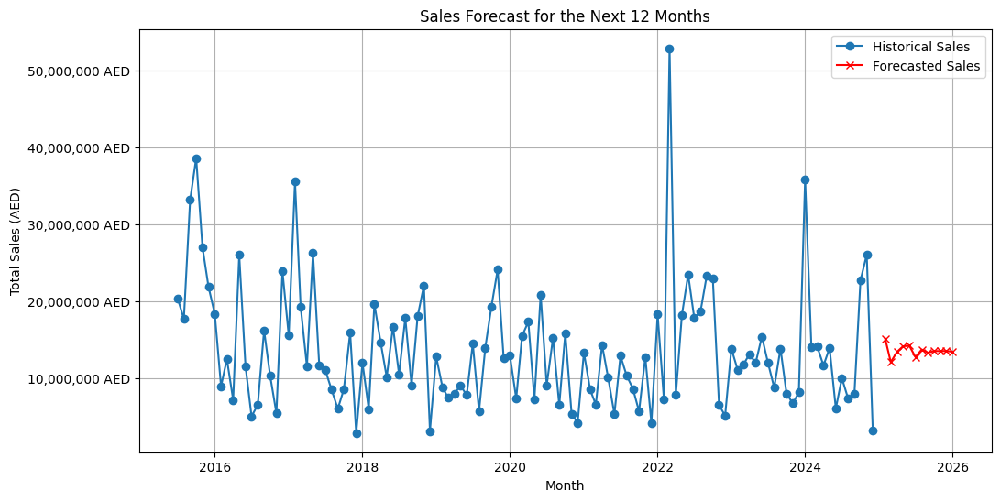

# Data Analysis and Sales Forecasting for a Trading Company

This project provides actionable business insights and accurate sales forecasts by analyzing sales and purchase data using advanced data analytics techniques.

---

## Objectives
- Analyze purchase orders to evaluate vendor contributions.
- Identify sales trends across various divisions and customer segments.
- Provide key performance metrics to support strategic decision-making.
- Implement predictive analytics to forecast future sales using the ARIMA model.

---

## Key Features
- **Data Analysis**:
  - **Purchase Orders**: Analysis of vendor contributions, purchase amounts, and currency utilization.
  - **Sales Orders**: Insights into customer segmentation and divisional sales performance.
  - **Dashboards**: Visualized data to highlight key metrics like customer contributions and delivery modes.

- **Predictive Modeling**:
  - Implemented the **ARIMA** (Auto-Regressive Integrated Moving Average) model for sales forecasting.
  - Predicted sales trends for the next 12 months to aid strategic decisions.

- **Visualization Tools**:
  - Leveraged Python and Power BI for dashboards and visual representations of data.

---

## Data Sources and Tools
### Data Sources
- Historical purchase and sales orders extracted from the company’s ERP system covering FY 2018–2024.

### Tools
- **Python**:
  - Libraries for data processing, analysis, and modeling: `pandas`, `matplotlib`, `seaborn`, and `statsmodels`.
- **Power BI**:
  - Used for interactive dashboards and creating business intelligence visualizations.
- **Dependencies**:
  - Install all required libraries using the provided `requirements.txt` file.

---

## Algorithm Used: ARIMA
The **ARIMA** (Auto-Regressive Integrated Moving Average) model was used for sales forecasting. Its key components are:
1. **Auto-Regressive (AR)**: Relies on past sales data to predict future values.
2. **Integrated (I)**: Ensures stationarity by removing trends and seasonality from the data.
3. **Moving Average (MA)**: Uses past prediction errors to refine forecasts.

**Steps for Forecasting**:
1. **Data Preparation**: Grouped sales data by months to create a clear historical trend.
2. **Model Training**: ARIMA was trained to detect patterns, such as general trends and seasonal fluctuations.
3. **Forecasting**: Predicted sales for the next 12 months to assist in inventory and marketing decisions.

---

## Visualizations

### Historical Monthly Sales (2018–2024)
This plot shows the sales trends over time, highlighting significant peaks and troughs in performance.



### Forecasted Sales for the Next 12 Months
Using the ARIMA model, this visualization predicts sales for the next year, offering a foundation for strategic planning.



---

## Getting Started

### Installing Dependencies
1. Clone the repository:
   ```bash
   git clone https://github.com/your-repo-name
Navigate into the project directory:
bash
Copy code
cd your-repo-name
Install required dependencies:
bash
Copy code
pip install -r requirements.txt
Running the Code
Open the Jupyter Notebooks to explore and run the analysis:

data_analysis.ipynb: Data cleaning, exploratory analysis, and insights.
sales_forecasting_arima.ipynb: ARIMA model training and forecasting.
Visualizations:

Run the scripts to generate plots for historical trends and future forecasts.
Power BI:

Open the dashboard files in Power BI for additional insights.
